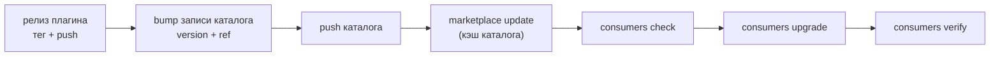

# Реестр потребителей

## Зачем он есть

Поставка плагином решает «как обновлять», но не отвечает на «кого обновлять и что
у него стоит». Скан машины 2026-09-14 показал цену этого пробела: девять проектов с
`.omp/`, из них три с плагином, шесть на плоских копиях, а `erp-main` — плагин поверх
копий; плагина `1c` нет в пяти проектах; версии `unica` разъехались (0.12.0 против
0.12.3). Ни одна из этих величин не была видна ниоткуда: `omp plugin list` смотрит
только на текущий проект, а «список потребителей» не существовал.

Реестр — ответ: **один файл, который знает всех потребителей машины**, и инструмент,
который по нему считает дрейф и обновляет.

## Где живёт и почему так

| Что | Где | В git |
|---|---|---|
| Данные — `.consumers.json` в корне клона каталога | рядом с `.omp-plugin/marketplace.json` | **нет** (`.gitignore`) |
| Схема — `schemas/consumer-registry.schema.json` | `schemas/` этого репо | да |
| Инструмент — `scripts/consumers.py` | `scripts/` этого репо | да (создаётся планом [consumer-delivery](../plans/consumer-delivery.md)) |

Данные не коммитятся, потому что в них абсолютные пути и состав конкретной машины:
у второй машины тот же реестр выглядел бы иначе. Схема коммитится, потому что это
знание: формат обязан быть версионируемым и проверяемым, а не «как получилось у меня».

**Отвергнутые альтернативы** (обе пробовались как проект решения):

- *Реестр в машинном слое `sot-omp-core`* (`~/.omp/agent/…`). Машинный слой — верное
  место для машинного состояния, но инструмент уехал бы от каталога, который читает, и
  перестал бы быть частью клона каталога; синхронизацию пришлось бы вести вторым
  механизмом.
- *Плоский список вида `~/ontoship-projects.txt`* (архивный план `marketplace-delivery`).
  Список имён не несёт наблюдаемого состояния и не покрывает плагины чужих каталогов
  (`unica@unica`) — то есть ровно ту часть контура, где версии и разъезжаются.

## Формат

Верхний уровень (`schemas/consumer-registry.schema.json`, draft 2020-12):

| Поле | Смысл |
|---|---|
| `schemaVersion` | версия формата; инструмент отказывается читать незнакомую |
| `machine` | hostname — видно, что реестр описывает одну машину |
| `updated` | когда реестр последний раз писала машина |
| `catalog` | `name` + `remote` каталога, к которому реестр относится |
| `discoverRoots` | каталоги, в которых ищутся проекты с `.omp/` (обнаружение неучтённых) |
| `exclude` | пути, которые не потребители: репозитории-источники плагинов, машинный слой |
| `consumers` | сам список; `name` и `path` уникальны |

Потребитель:

| Поле | Смысл |
|---|---|
| `name` | слаг для `--only` |
| `path` | абсолютный путь к корню проекта |
| `plugins[]` | **ожидаемый состав**: `id` (`<плагин>@<каталог>`), `scope` (`project`/`user`), `installed` (наблюдаемое, `null` — не поставлен), `pin` (проект сознательно держит версию) |
| `legacy.flat[]` | плоские копии пакета в проекте, путями от корня |
| `worktreeInit` | `hook` (путь к скрипту инициализации ворктри) + `installsPlugins` (ставит ли он плагины по-настоящему) |
| `notes` | заметка оператора: особенности, известные отклонения |
| `lastChecked`, `lastUpgraded` | когда инструмент наблюдал / обновлял |

**Желаемой версии в реестре нет намеренно.** Версию для `omp plugin upgrade` задаёт
запись каталога (см. [контракт каталога](marketplace-catalog.md)); реестр хранит только
наблюдаемое и ожидаемый *состав*. Две правды о версии — тот самый дрейф, от которого
уходим.

`pin` — единственное исключение и оно явное: проект **сознательно** держит версию.
Пин, который соблюдён, но отстал от каталога, — `pinned` (не ошибка). Пин, который
нарушен (стоит не то, что закреплено), — уже `stale`: обещание в реестре разошлось с
машиной.

## Откуда берётся «актуальная» версия

Инструмент читает **кэш каталога** — тот же файл, из которого работает `omp plugin
upgrade`: `~/.omp/marketplaces.json` → `catalogPath` нужного маркетплейса. Рабочее
дерево этого репо не читается: локальный `main` может быть впереди запушенного, и
тогда `check` показывал бы дрейф, который потребитель физически не может закрыть до
push. Обновление кэша — отдельный явный шаг (`upgrade` делает его сам, `check`
принимает `--refresh`).

## Что считается дрейфом

| Вид | Признак | `upgrade` |
|---|---|---|
| `missing` | в реестре есть, `installed: null` | ставит плагин |
| `stale` | `installed` ≠ версия в кэше каталога, либо пин нарушен (в том числе «закреплён, а не поставлен») | обновляет (кроме закреплённых) |
| `scope` | установлен в `user`, а в реестре `project` | ставит в `project` (user-scope виден во всех проектах и путает версии) |
| `unknown` | плагин в реестре есть, а каталог его не знает (опечатка в id, незарегистрированный маркетплейс, пустой кэш) | ничего: ставить нечего, причина печатается |
| `pinned` | `pin` соблюдён, но каталог ушёл вперёд | **пропускает**, показывает как `pinned` (это не ошибка) |
| `legacy` | есть плоские копии | ставит плагин (копия его перекрывает, поведение проекта не меняется), но копии надо снять: `migrate` |
| `worktree-gap` | хук ворктри есть, но плагины в них не ставит | ничего — правится хуком проекта; ворктри останутся без плагинов (ADR §4) |
| `unmanaged` | проект с `.omp/` не в реестре и не в `exclude` | ничего; сообщается как кандидат в реестр |
| `error` | потребитель недоступен: пути нет, `.omp/` нет, `omp plugin list` провалился или вернул не-JSON | ничего; строка отчёта, остальные потребители проверяются дальше |

`error` — не вид дрейфа, а отказ наблюдения: он не должен ронять отчёт по остальным
потребителям, но код выхода остаётся `1`. Исключение — отсутствие самого `omp` в PATH:
это отказ окружения (exit `2`), а не дрейф: без `omp` инструменту нечего наблюдать.

## Контракт инструмента

```
python3 scripts/consumers.py discover [--json]          # что есть на машине; неучтённые потребители
python3 scripts/consumers.py scan     [--json]          # обновить наблюдаемое: installed, legacy.flat, worktreeInit
python3 scripts/consumers.py check    [--refresh] [--only NAME] [--json]
python3 scripts/consumers.py upgrade  [--only NAME] [--dry-run] [--yes] [--json]
python3 scripts/consumers.py verify   [--only NAME] [--json]   # gitmark index + deploy-check.sh + gitmark version
python3 scripts/consumers.py migrate  [--only NAME] [--apply] [--keep PATH] [--accept-divergent] [--accept-unique] [--json]   # снос плоских копий
```

- Коды выхода: `0` — чисто; `1` — найден дрейф, недоступный потребитель или провал
  проверки; `2` — ошибка использования либо реестр не соответствует схеме.
- `migrate` **без** `--apply` — только отчёт; это и есть его режим по умолчанию
  (отдельного `--dry-run` нет, чтобы не было флага, который ничего не меняет).
- Недоступный потребитель виден во всех командах и везде даёт exit `1`: в `check` —
  строкой `error`, в `upgrade` — записью в `skipped` (и в JSON, и в тексте), в
  `migrate` — записью в `errors`. `upgrade` не бывает зелёным, если хоть один
  потребитель не наблюдался.
- Глобальные ключи: `--registry` (по умолчанию `.consumers.json` в корне клона),
  `--schema`, `--marketplaces` (реестр omp — источник версий каталога). Последние два
  нужны тестам и нестандартным установкам; в обычной работе не требуются.
- Валидация реестра — **своим** валидатором, без внешних зависимостей: python-модуля
  `jsonschema` на машине нет (проверено 2026-09-14), а инструмент обязан запускаться на
  голом python3.
- `migrate` без `--apply` — только отчёт (что будет снято, что расходится с пакетом).
  Молча не удаляется ничего: файл, отличающийся от пакетного, — решение оператора.
- Классификация файла плоской копии: `identical` (совпал с поставленным пакетом),
  `divergent` (такой путь в пакете есть, содержимое иное), `unique` (пути в пакетах
  нет), `unverifiable` (пакетов нет вовсе — сравнивать не с чем). `--apply` снимает
  потребителя только когда `divergent`/`unique`/`unverifiable` пусто или закрыто
  `--keep`; `--keep` принимает и относительный путь, и абсолютный внутри проекта.
- **Расходящиеся и отсутствующие в пакетах файлы снимаются только по решению
  оператора**: `--accept-divergent` и `--accept-unique` — раздельные решения (принять
  старую генерацию пакета ≠ принять файл, которого в пакете нет). Без них такие файлы
  блокируют снятие целиком, а в отчёте видно, что именно блокирует. `unverifiable`
  не принимается никогда: без поставленных пакетов сравнивать не с чем — сначала
  `upgrade`.
- Плоской копией считается каталог `.omp/{skills,rules,commands,scripts}` **с хотя бы
  одним файлом**: пустой каталог ничего не перекрывает и дрейфом не считается.
- `verify` различает уровень проверки: `gitmark index` и `version` — 0 или провал;
  `deploy-check.sh` — 0 чисто, 1 критика (провал), **2 предупреждения** (пакет
  работает: так `deploy-check` и документирован в шапке скрипта). В отчёте
  предупреждение помечается `⚠`, код выхода при нём остаётся `0`.
- `scan --json` печатает реестр с обновлённым наблюдаемым, но **не пишет** файл: так
  удобно сравнить до и после, не трогая реестр.
- **Свой dry-run, а не флаг omp.** `omp plugin upgrade --dry-run` флаг игнорирует и
  выполняет обновление (проверено 2026-09-14: `erp-demo`, `1c` 0.1.1 → 0.1.2 при
  `--dry-run`). Поэтому `--dry-run` инструмента обязан **не вызывать** `omp plugin
  upgrade` вовсе — только печатать план; проверять флагом omp нельзя.
- Инструмент идемпотентен: повторный `upgrade`/`scan` не меняет состояние.

## Поток поставки



`check` до `upgrade` — не формальность: он показывает, кого обновление затронет и где
стоит `pin`, до того как что-то изменилось.

## Состояние машины на 2026-09-14

Девять потребителей: `erp-demo` и `sot-omp-marketplace` — чистая плагинная установка,
`erp-main`, `erp-mini`, `ut-10`, `retail`, `zupupr`, `rusbread-master-site`,
`subvost-xray-tun` — с плоскими копиями (в `erp-main` и `zupupr` плагин стоит поверх
копий). Живая картина — `python3 scripts/consumers.py check`, а не этот абзац; он
фиксирует, почему контур заведён.

Работы по приведению машины к плагинной поставке — план
[consumer-delivery](../plans/consumer-delivery.md).
